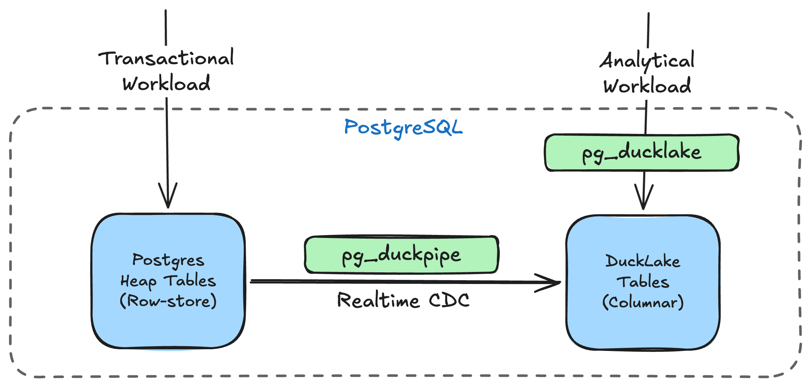

<div align="center">

# pg_duckpipe

PostgreSQL extension for real-time CDC to pg_ducklake

[](https://hub.docker.com/r/pgducklake/pgduckpipe)
[](https://github.com/YuweiXIAO/pg_duckpipe/blob/main/LICENSE)

</div>

## Overview

`pg_duckpipe` brings real-time change data capture (CDC) to PostgreSQL, enabling HTAP by continuously syncing your row tables to [DuckLake](https://github.com/relytcloud/pg_ducklake/) columnar tables. Run transactional and analytical workloads in a single database.



## Key Features

- **One-command setup**: `duckpipe.add_table()` creates the columnar target and starts syncing automatically
- **Real-time CDC**: streams WAL changes continuously with ~5 s default flush latency (tunable)
- **Sync groups**: group multiple tables to share a single publication and replication slot

## Quick Start

```bash
# Start PostgreSQL with pg_duckpipe (includes pg_duckdb + pg_ducklake)
docker run -d --name duckpipe \
  -p 15432:5432 \
  -e POSTGRES_PASSWORD=duckdb \
  pgducklake/pgduckpipe:18-main

# Connect
PGPASSWORD=duckdb psql -h localhost -p 15432 -U postgres
```

Create a table, add it to sync, insert some rows, and query the columnar copy:

```sql
-- Create a source table (must have a primary key)
CREATE TABLE orders (id BIGSERIAL PRIMARY KEY, customer_id BIGINT, total INT);

-- Insert some existing data
INSERT INTO orders(customer_id, total) VALUES (101, 4250), (102, 9900);

-- Start syncing to DuckLake (snapshots existing rows, then streams new changes)
SELECT duckpipe.add_table('public.orders');

-- New writes are captured in real time
INSERT INTO orders(customer_id, total) VALUES (103, 1575);

-- Query the columnar copy (wait a few seconds for CDC to flush)
SELECT * FROM orders_ducklake;

-- Monitor sync state
SELECT source_table, state, rows_synced FROM duckpipe.status();
```

## Requirements

> The Docker image ships everything preconfigured. The notes below apply when installing from source.

- **PostgreSQL 18** — currently the only tested version; older versions may work but are unsupported
- **pg_ducklake** (which bundles pg_duckdb and libduckdb) must be installed
- `wal_level = logical` with sufficient `max_replication_slots` and `max_wal_senders`
- Both extensions must be preloaded: `shared_preload_libraries = 'pg_duckdb, pg_duckpipe'`
- Source tables must have a **PRIMARY KEY** (required by logical replication to identify rows)

## Benchmark

Sysbench on Apple M1 Pro, 100k rows/table, 30s OLTP phase:

| Scenario | Snapshot | OLTP TPS | Avg Lag | Consistency |
|----------|----------|----------|---------|-------------|
| 1 table, `oltp_insert` | 14,569 rows/s | 9,261 | 2.7 MB | PASS |
| 4 tables, `oltp_insert` | 26,353 rows/s | 8,076 | 55 MB | PASS |
| 1 table, `oltp_read_write` | 6,020 rows/s | 614 | 154 MB | PASS |
| 4 tables, `oltp_read_write` | 38,858 rows/s | 444 | 332 MB | PASS |

Full breakdown (flush latency, phase timing, snapshot per-table, WAL cycles): [benchmark/results/report.md](benchmark/results/report.md)

```bash
./benchmark/bench_suite.sh              # Run all 4 scenarios (30s each)
./benchmark/bench_suite.sh --duration 10  # Quick smoke test
```

## Build & Test

```bash
make && make install             # Build and install the extension
make installcheck                # Run all regression tests
make check-regression TEST=api   # Run a single test
```

## Documentation

| Doc | Description |
|-----|-------------|
| [doc/QUICKSTART.md](doc/QUICKSTART.md) | Hands-on walkthrough: add, remove, re-add, resync, multi-table, monitoring |
| [doc/USAGE.md](doc/USAGE.md) | SQL usage, monitoring, **configuration (GUCs)**, and tuning |
| [doc/DESIGN_V2.md](doc/DESIGN_V2.md) | Historical v2 design notes |
| [benchmark/README.md](benchmark/README.md) | Benchmark harness |

## License

[MIT](LICENSE)
