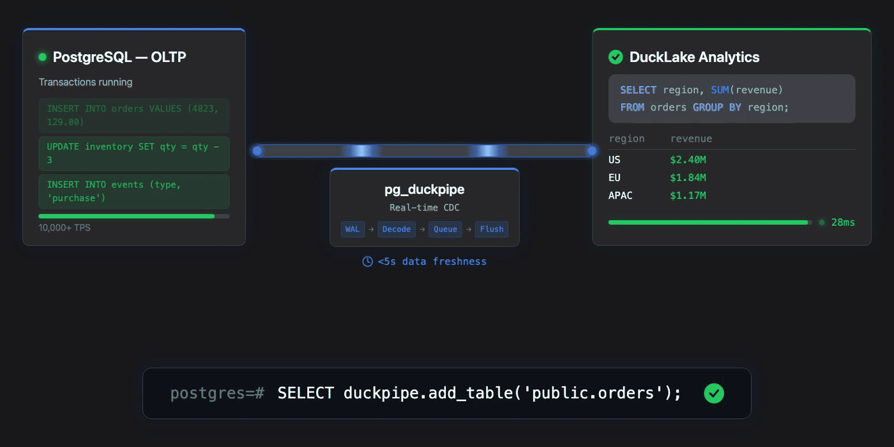
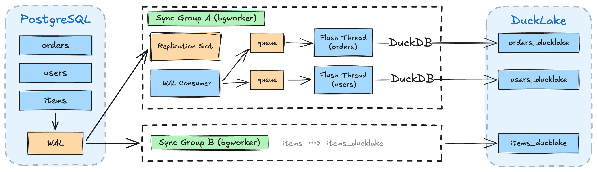

<div align="center">

# pg_duckpipe

PostgreSQL extension for real-time CDC to pg_ducklake

[](https://github.com/relytcloud/pg_duckpipe/actions/workflows/ci.yaml)
[](https://hub.docker.com/r/pgducklake/pgduckpipe)
[](https://github.com/relytcloud/pg_duckpipe/blob/main/LICENSE)

</div>

## Overview

`pg_duckpipe` brings real-time change data capture (CDC) to PostgreSQL, enabling HTAP by continuously syncing your row tables to [DuckLake](https://github.com/relytcloud/pg_ducklake/) columnar tables. Run transactional and analytical workloads in a single database.




## Key Features

- **One-command setup**: `duckpipe.add_table()` creates the columnar target and starts syncing automatically
- **Real-time CDC**: streams WAL changes continuously with ~5 s default flush latency (tunable)
- **Sync groups**: group multiple tables to share a single publication and replication slot

## Quick Start

```bash
curl -sSfL https://raw.githubusercontent.com/relytcloud/pg_duckpipe/main/install.sh | bash
```

This pulls the Docker image, starts PostgreSQL with all extensions loaded, and drops you into psql. Then try:

```sql
-- Create a source table (must have a primary key)
CREATE TABLE orders (id BIGSERIAL PRIMARY KEY, customer_id BIGINT, total INT);

-- Insert some existing data
INSERT INTO orders(customer_id, total) VALUES (101, 4250), (102, 9900);

-- Start syncing to DuckLake (snapshots existing rows, then streams new changes)
SELECT duckpipe.add_table('public.orders');

-- New writes are captured in real time
INSERT INTO orders(customer_id, total) VALUES (103, 1575);

-- Query the columnar copy (wait a few seconds for CDC to flush)
SELECT * FROM orders_ducklake;

-- Monitor sync state
SELECT source_table, state, rows_synced FROM duckpipe.status();
```

## Requirements

> The Docker image ships everything preconfigured. The notes below apply when installing from source.

- **PostgreSQL 17 or 18** (tested in CI)
- **pg_ducklake** (which bundles pg_duckdb and libduckdb) must be installed
- `wal_level = logical` with sufficient `max_replication_slots` and `max_wal_senders`
- Both extensions must be preloaded: `shared_preload_libraries = 'pg_duckdb, pg_duckpipe'`
- Source tables must have a **PRIMARY KEY** (required by logical replication to identify rows)

## Benchmark

Sysbench on Apple M1 Pro, 100k rows/table, 30s OLTP phase:

| Scenario | Snapshot | OLTP TPS | Avg Lag | Consistency |
|----------|----------|----------|---------|-------------|
| 1 table, `oltp_insert` | 136,240 rows/s | 10,102 | 3.3 MB | PASS |
| 4 tables, `oltp_insert` | 163,599 rows/s | 9,413 | 64.6 MB | PASS |
| 1 table, `oltp_read_write` | 132,450 rows/s | 627 | 170.8 MB | PASS |
| 4 tables, `oltp_read_write` | 150,830 rows/s | 450 | 369.3 MB | PASS |

Full breakdown (flush latency, phase timing, snapshot per-table, WAL cycles): [benchmark/suite/results/report.md](benchmark/suite/results/report.md)

```bash
./benchmark/suite/bench_suite.sh              # Run all 4 scenarios (30s each)
./benchmark/suite/bench_suite.sh --duration 10  # Quick smoke test
```

## Architecture



pg_duckpipe streams WAL changes through a decoupled producer-consumer pipeline:

- **Sync groups**: each group runs as an isolated bgworker process with its own replication slot — a slow table in one group cannot affect another
- **Per-table flush threads**: each table gets a dedicated OS thread that drains its change queue and writes to DuckLake via DuckDB, enabling parallel flushes across tables
- **Backpressure**: when queued changes exceed a threshold, the WAL consumer pauses until flush threads catch up, bounding memory usage

## Build & Test

### With Claude Code

If you use [Claude Code](https://claude.com/claude-code):

- `/build` — Clone, build, and install PostgreSQL 18, pg_ducklake, and pg_duckpipe from source into a local `deps/` directory.
- `/setup` — Start a configured PostgreSQL instance (port 5588) with all extensions loaded and ready to use.

### Manual

Requires PostgreSQL 17+ and pg_ducklake to be installed first. Set `PG_CONFIG` to point to your installation:

```bash
PG_CONFIG=/path/to/pg_config make install   # Build and install the extension
PG_CONFIG=/path/to/pg_config make installcheck   # Run all regression tests
make check-regression TEST=api              # Run a single test
```

## Documentation

| Doc | Description |
|-----|-------------|
| [doc/QUICKSTART.md](doc/QUICKSTART.md) | Hands-on walkthrough: add, remove, re-add, resync, multi-table, monitoring |
| [doc/USAGE.md](doc/USAGE.md) | SQL usage, monitoring, **configuration (GUCs)**, and tuning |
| [doc/DATA_TYPES.md](doc/DATA_TYPES.md) | Supported PG→DuckDB type mappings and limitations |
| [doc/FAN_IN.md](doc/FAN_IN.md) | Fan-in streaming: multiple sources to one target, use cases, operations |
| [doc/ACCESS_CONTROL.md](doc/ACCESS_CONTROL.md) | Permissions: who can manage, monitor, and query target tables |
| [doc/DAEMON.md](doc/DAEMON.md) | Standalone daemon with REST API: setup, endpoints, curl examples |
| [doc/DESIGN_V2.md](doc/DESIGN_V2.md) | Historical v2 design notes |
| [benchmark/README.md](benchmark/README.md) | Benchmark harness |

