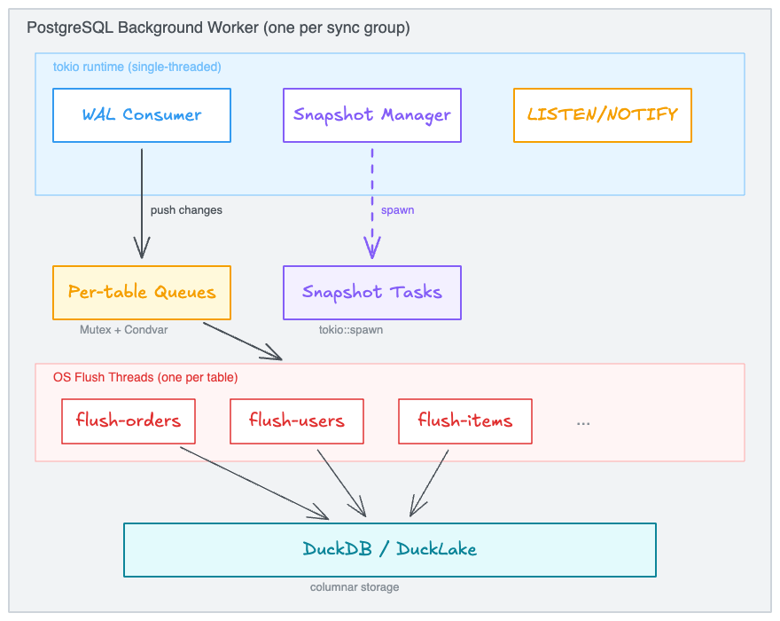
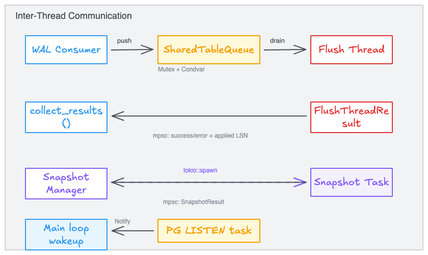
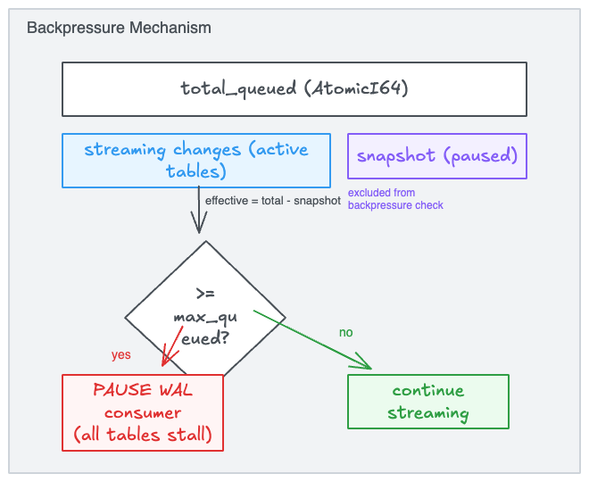
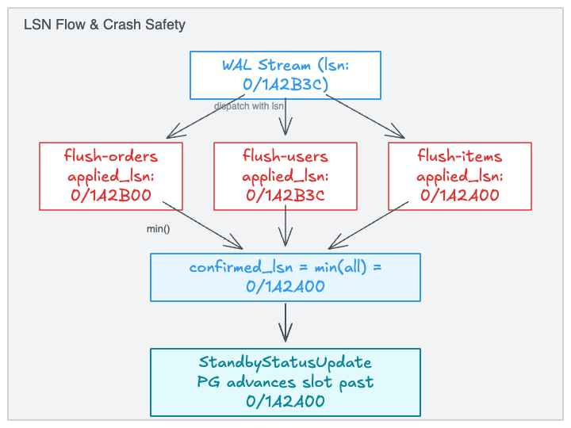

# pg_duckpipe Parallelism Model

How pg_duckpipe organizes threads, async tasks, and inter-thread communication to achieve sub-second CDC latency with bounded memory.

---

## Table of Contents

1. [Overview](#1-overview)
2. [Thread Architecture](#2-thread-architecture)
3. [Parallel Table Processing](#3-parallel-table-processing)
4. [Inter-Thread Communication](#4-inter-thread-communication)
5. [Backpressure](#5-backpressure)
6. [Crash Safety & LSN Management](#6-crash-safety--lsn-management)

---

## 1. Overview

pg_duckpipe implements a **decoupled producer-consumer architecture**. A single WAL consumer thread reads the replication stream, decodes changes, and dispatches them into per-table queues. Independent OS flush threads drain those queues and write to DuckDB/DuckLake. Initial table snapshots run as parallel async tasks alongside WAL streaming (see [known limitation](#32-parallel-snapshots) on snapshot I/O).



**Key design properties:**

| Property | How |
|----------|-----|
| Non-blocking WAL consumption | Flush threads run independently; WAL consumer just pushes to queues |
| Bounded memory | Backpressure pauses WAL consumer when queues exceed threshold |
| Sub-second latency | Flush threads self-trigger on time (interval) or size (batch threshold) |
| Crash safety | Slot never advances past durably flushed data (`confirmed_lsn = min(applied_lsn)`) |
| Parallel snapshots | Multiple tables snapshot concurrently via `tokio::spawn`; DuckDB loads run on separate threads (see [known limitation](#32-parallel-snapshots)) |

---

## 2. Thread Architecture

### 2.1 Thread Map

```
PostgreSQL postmaster
  │
  └── pg_duckpipe bgworker         ← OS process, one per sync group
        │
        ├── [main] tokio runtime    ← single-threaded async executor
        │     ├── WAL consumer      ← streaming replication loop
        │     ├── LISTEN/NOTIFY     ← wakeup task (persistent)
        │     ├── Snapshot task #1  ← tokio::spawn (per-table, temporary)
        │     ├── Snapshot task #2  ← runs in parallel with #1
        │     └── ...
        │
        ├── [thread] flush-orders           ← OS thread, persistent
        │     └── tokio runtime (own)       ← for async PG metadata calls
        │
        ├── [thread] flush-users            ← OS thread, persistent
        │     └── tokio runtime (own)
        │
        ├── [thread] flush-items            ← OS thread, persistent
        │     └── tokio runtime (own)
        │
        └── ...
```

### 2.2 Thread Responsibilities

| Thread | Type | Lifetime | Owns |
|--------|------|----------|------|
| **bgworker main** | OS process (PG) | Entire group lifetime | tokio runtime, WAL connection, FlushCoordinator |
| **Flush thread** | `std::thread` | Persistent per table | DuckDB connection, tokio runtime, local change accumulator |
| **Snapshot task** | `tokio::spawn` | One-shot per table | PG COPY connection, temp replication slot |
| **LISTEN task** | `tokio::spawn` | Persistent, auto-respawned | PG async connection |

### 2.3 OS Threads vs Async Tasks

DuckDB flush operations are **CPU-bound and blocking** — running them as async tasks would stall the single-threaded tokio runtime and block WAL consumption. Each flush thread is a real OS thread so it can do heavy DuckDB work (buffer, compact, merge) while the WAL consumer continues decoding and dispatching without interruption.

Snapshot tasks use async I/O (PG `COPY TO STDOUT`) with `spawn_blocking` for the DuckDB load step, keeping the async runtime responsive.

---

## 3. Parallel Table Processing

### 3.1 Per-Table Flush Parallelism

Each table has its own independent flush thread. The WAL consumer demultiplexes the interleaved WAL stream into per-table queues, and each flush thread processes its queue independently:

```
WAL stream (interleaved):
  [orders:I] [users:U] [orders:I] [items:D] [orders:I] [users:I] ...
       │          │          │          │          │          │
       ▼          ▼          ▼          ▼          ▼          ▼
  ┌─────────┐ ┌─────────┐ ┌─────────┐ ┌─────────┐ ┌─────────┐ ┌─────────┐
  │ orders  │ │ users   │ │ orders  │ │ items   │ │ orders  │ │ users   │
  │ queue   │ │ queue   │ │ queue   │ │ queue   │ │ queue   │ │ queue   │
  └────┬────┘ └────┬────┘ └────┬────┘ └────┬────┘ └────┬────┘ └────┬────┘
       │           │           │           │           │           │
       ▼           ▼                       ▼                      ▼
  ┌─────────┐ ┌─────────┐            ┌─────────┐            ┌─────────┐
  │ flush   │ │ flush   │            │ flush   │            │ flush   │
  │ orders  │ │ users   │            │ items   │            │ users   │
  │ (batch) │ │ (batch) │            │ (batch) │            │ (batch) │
  └─────────┘ └─────────┘            └─────────┘            └─────────┘
```

A slow table doesn't block other flush threads directly — each drains its own queue and flushes to DuckDB on its own schedule. However, if total queued changes across all streaming tables exceed `max_queued_changes`, global [backpressure](#5-backpressure) pauses WAL consumption for all tables. Flush triggers independently when either:

- **Batch threshold**: accumulated changes reach `flush_batch_threshold`
- **Time interval**: `flush_interval_ms` has elapsed since last flush

### 3.2 Parallel Snapshots

When multiple tables are added simultaneously, their initial snapshots (`COPY TO STDOUT` from PG → load into DuckDB) run as independent `tokio::spawn` tasks, executing concurrently:

```
Time ──────────────────────────────────────────────────────────▶

WAL Consumer:  ───[streaming all tables continuously]──────────▶

Table "orders":
  Snapshot:    ╠══ COPY orders ══╣
  Flush:       [paused: buffering WAL]  → unpause → [flushing]

Table "users":
  Snapshot:    ╠═══ COPY users ═══╣          (parallel with orders)
  Flush:       [paused: buffering WAL]    → unpause → [flushing]

Table "items":
  State:       ── STREAMING (already synced) ──────────────────▶
  Flush:       [flushing normally, unaffected by other snapshots]
```

During a snapshot, the table's flush thread is **paused** — it accumulates WAL changes but doesn't flush them. Once the snapshot completes, the flush thread unpauses and applies the buffered changes, filtering out any with `lsn ≤ snapshot_lsn` (already captured by the COPY).

> **Known limitation:** Each snapshot has an async CSV producer and a `spawn_blocking` DuckDB consumer. The DuckDB consumer runs on separate OS threads and parallelizes properly, but the CSV producer shares the single-threaded tokio runtime with the WAL consumer. Its synchronous file I/O (`fs::File::write_all`) and byte-by-byte quote tracking briefly block WAL consumption for all tables between `.await` points. This should be fixed by moving producers to `spawn_blocking` or dedicated threads so the data plane (snapshots) never interferes with the control plane (WAL streaming).

---

## 4. Inter-Thread Communication

### 4.1 Communication Map



### 4.2 Channel Details

| Channel | Type | Direction | Purpose |
|---------|------|-----------|---------|
| Change queue | `Mutex<Vec<Change>>` + `Condvar` | Main → Flush thread | Per-table change delivery. Push: brief lock. Drain: Condvar wait with timeout |
| Flush results | `std::sync::mpsc` | Flush thread → Main | Report success/error + applied LSN (non-blocking `try_recv`) |
| Snapshot results | `std::sync::mpsc` | Snapshot task → Manager | Report snapshot completion (non-blocking `try_recv`) |
| Wakeup notify | `tokio::sync::Notify` | LISTEN task → Main loop | Instant wakeup on `add_table`/`resync`/`enable` |

### 4.3 Push Path (WAL Consumer → Queue)

```rust
// flush_coordinator.rs — push_change()
let mut guard = entry.queue_handle.inner.lock().unwrap();  // brief lock
guard.changes.push(change);
backpressure.total_queued.fetch_add(1, Ordering::Relaxed);
entry.queue_handle.condvar.notify_one();                    // wake flush thread
```

### 4.4 Drain Path (Queue → Flush Thread)

```rust
// flush_coordinator.rs — flush_thread_main()
let mut guard = queue_handle.inner.lock().unwrap();
if guard.changes.is_empty() {
    let (g, _) = queue_handle.condvar.wait_timeout(guard, wait_timeout).unwrap();
    guard = g;
}
let drain_n = guard.changes.len().min(batch_threshold);     // capped drain
let changes: Vec<Change> = guard.changes.drain(..drain_n).collect();
drop(guard);                                                 // release lock early
accumulated.extend(changes);
```

---

## 5. Backpressure

Backpressure is applied **globally** — when triggered, the WAL consumer pauses entirely, affecting all tables. This is because WAL is a single ordered stream that cannot be selectively consumed per table.

### 5.1 Mechanism



### 5.2 Snapshot Isolation from Backpressure

Without special handling, a long-running snapshot would inflate `total_queued` and trigger backpressure, stalling WAL streaming for *all* tables — even healthy ones. The system tracks snapshot-buffered changes in a separate `snapshot_queued` counter and excludes them from the backpressure check:

```rust
// flush_coordinator.rs
pub fn is_backpressured(&self) -> bool {
    let total = self.backpressure.total_queued.load(Ordering::Relaxed);
    let snapshot = self.backpressure.snapshot_queued.load(Ordering::Relaxed);
    (total - snapshot) >= self.backpressure.max_queued
}
```

### 5.3 Impact on Parallelism

- **When not backpressured**: WAL consumer runs at full speed, all flush threads process independently — maximum parallelism.
- **When backpressured**: WAL consumer skips its polling round (all tables stall together), but flush threads continue draining their queues. Once enough changes are flushed, backpressure clears and WAL consumption resumes.
- **Snapshot tables are immune**: their buffered changes don't count toward the backpressure threshold, so adding a new table via `add_table()` won't degrade throughput for existing tables.

---

## 6. Crash Safety & LSN Management

### 6.1 LSN Flow

Each flush thread independently tracks the LSN of its last successful flush. The main thread computes `confirmed_lsn` as the minimum across all tables — the safe restart point.



### 6.2 Safety Invariant

`confirmed_lsn = min(applied_lsn across all active tables)`

- If **any** table has never flushed (`applied_lsn = 0`), confirmed_lsn stays at 0 — the slot retains all WAL. Tables in CATCHUP use `snapshot_lsn` as a floor (via `COALESCE(applied_lsn, snapshot_lsn)`).
- On crash, the replication slot replays from `confirmed_lsn`. Changes already flushed to DuckDB are idempotent (DELETE + INSERT by PK).
- Flush threads commit to DuckDB **before** sending the mpsc result, so the in-memory `per_table_lsn` is always >= the persisted PG value.
- The slowest table determines how far the slot can advance. This is the cost of per-table parallelism — a stalled table holds back WAL retention for the entire group.
